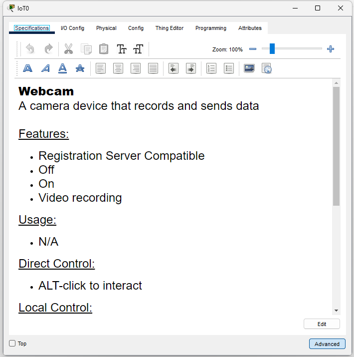
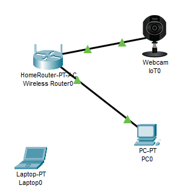

# Laboratório Cisco Packet Tracer - Erro de Conexão entre Roteador e Webcam

## Descrição
Este laboratório simula uma rede e a correção do erro "The cable cannot be connected to that port" no Cisco Packet Tracer.

 

## Requisitos
- Cisco Packet Tracer (download via https://www.netacad.com/resources/lab-downloads?courseLang=en-US)
- Arquivo `.pkt` incluído neste repositório.

 

## 📋 Passo a Passo

1. Adicione os dispositivos:

- 1x PC (End Devices > End Devices > PC)
- 1x Roteador (Network Devices > Wireless Devices > Home Router)
- 1x Laptop (End Devices > End Devices > Laptop)
- 1x Webcam (End Devices > Home > Webcam)

 

2. Tente conectar os dispositivos com um cabo.

- Clique em "Connections" e em "Automatically Choose connection type". Agora selecione o roteador e depois clique no PC.
- Faça o mesmo, mas dessa vez entre o roteador e a webcam.

 

3. Erro exibido:

> "The cable cannot be connected to that port"

 

## 🔎 Causa Identificada

O erro ocorreu porque eu estava tentando usar um **tipo de conexão inadequada** entre o roteador e a webcam.

 

## ✅ Solução Aplicada

- Troquei o tipo de conexão de cabeada para **wi-fi**.

 

## 🪜 Passo a passo da solução:

1. **Clique na Webcam**

Ao abrir a janela de configurações, clique na opção **"Advanced"** (localizada no canto inferior direito).

 

 

2. **Habilite a aba "I/O Config"**

Agora você verá a aba **"I/O Config"** ao lado de **"Specifications"**.

 

 

3. **Altere o adaptador de rede**

Dentro da aba **"I/O Config"**, altere a opção de adaptador de rede para:

**`PT-IOT-NM-1CE`**

 

4. **Tente conectar novamente**

Ao tentar gerar uma nova conexão entre o **roteador** e a **webcam**, o **erro desaparece**.

 

 

## ✅ Resultado Esperado

- Os dispositivos devem se conectar sem apresentar o erro.
- A comunicação entre o roteador e a webcam via **wi-fi** deve funcionar normalmente.

 

## ✅ Conclusão

Esse problema foi um ótimo exemplo da importância de escolher o **tipo correto de conexão e adaptador de rede** ao montar laboratórios no **Cisco Packet Tracer**, principalmente quando usamos dispositivos IoT.
